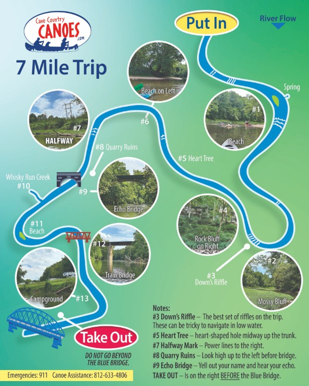

# CCC Emergency Map System

## Overview

The owner has asked that we make them an app. It will have a digital map that they have created of the river on it as well as safety information. Every year they get more phone calls of paddlers being confused and scared and needing directions or in some cases emergency services. The customers will be able to click a button and enter their approximate or precise location that will be sent to CCC. It also can be forwarded to emergency services if needed, making getting to them faster, safer, and less time-consuming.

This is the map that Cave Country Canoes has kindly provided us and will be used inside the app. 




# CCC Emergency Map System

## Overview

The CCC Emergency Map System is a Flask-based web application designed to manage emergency trips, distress alerts, and user feedback. It supports multiple user roles, including Customers, Employees, Admins, and Super Admins, each with specific permissions and functionalities.

## Features

- **User Authentication**: Secure registration and login for all user types.
  
- **Role-Based Access Control**: Different dashboards and functionalities based on user roles.
  
- **Trip Management**: Employees and Admins manage trips either from front end or back end.
  
- **Emergency Distress Alerts**: Customers can create distress alerts, which Employees can manage.
  
- **Site Details Management**: Admins and Super Admins can view and update site details.
  
- **User Management**: Super Admins can create and manage Admin and Super Admin accounts.
  
- **Customer Feedback**: Customers can leave reviews and ratings for trips.
  
- **Digital River Map**: Interactive map for users to send their location and view safety information.

## Installation

### Prerequisites

- Python 3.x
- MySQL Server

### Steps

1. **Clone the Repository**

    ```bash
    git clone https://github.com/yourusername/ccc_emergency_map.git
    cd ccc_emergency_map
    ```

2. **Set Up Virtual Environment**

    ```bash
    python3 -m venv venv
    source venv/bin/activate  # On Windows use `venv\Scripts\activate`
    ```

3. **Install Dependencies**

    ```bash
    pip install -r requirements.txt
    ```

4. **Configure Environment Variables**

    Create a `.env` file in the project root and set the following variables:

    ```
    SECRET_KEY=your_secret_key
    DB_HOST=localhost
    DB_USER=root
    DB_PASSWORD=<password>
    DB_NAME=ccc_emergency_map
    ```
    - Put this .env in same file level dependency as app.py. Make sure the password and the DB name match up.
    - **Replace `your_secret_key`** with a secure, randomly generated string.

5. **Set Up the Database**

    - **Create Database and Tables**

        Execute your provided MySQL SQL script to create the `ccc_emergency_map` database and all tables.

        ```bash
        mysql -u root -p <password> < ccc_emergency_map.sql
        ```

    - **Initialize Database Migrations**

        *(If using Flask-Migrate or similar tools. If not, skip this step.)*

        ```bash
        flask db init
        flask db migrate -m "Initial migration."
        flask db upgrade
        ```

6. **Run the Application**

    ```bash
    python app.py
    ```

    The application will be accessible at `http://localhost:5000/`.

## Usage

1. **Registration**

    - Users can register as Customers via the registration page.
    - Super Admins can create Admin and Super Admin accounts through the Super Admin dashboard.

2. **Login**

    - Navigate to the login page and enter your credentials.
    - Upon successful login, you'll be redirected to your respective dashboard based on your role.

3. **Dashboards**

    - **Customer Dashboard**: View trips, create distress alerts, view site details, and leave reviews.
    - **Employee Dashboard**: Handle assigned alerts, view all distress cases, view site details, and view customer reviews. Employees can mark distressed trips as safe (deleting logs). #TODO
    - **Admin Dashboard**: Create Employee accounts, manage site details, and override customer detailing. Has limited backend capability. #TODO
    - **Super Admin Dashboard**: Create and manage Admin and Super Admin accounts, and manage site details. Has root access. #TODO
    - **ALL Dashboards**: Can chat together

4. **Digital River Map** #TODO

    - Users can interact with the digital map to send their location.
    - The location can be approximate or precise and will be sent to CCC.
    - In emergencies, the location can be forwarded to emergency services for faster response.

## Security Considerations

- **Password Handling**: Passwords are hashed using Passlib's bcrypt implementation.
  
- **Environment Variables**: Sensitive information like secret keys and database passwords are managed via environment variables.
  
- **Role-Based Access**: Decorators ensure that users can only access functionalities permitted to their roles. #TODO

## Contributing

Contributions are welcome! Please fork the repository and submit a pull request for any enhancements or bug fixes.

## License

This project is licensed under the MIT License. See the [LICENSE](LICENSE) file for details.

## Acknowledgments

- Inspired by paddling enthusiasts and developers.
- Special thanks to Cave Country Canoes for providing the river map.
